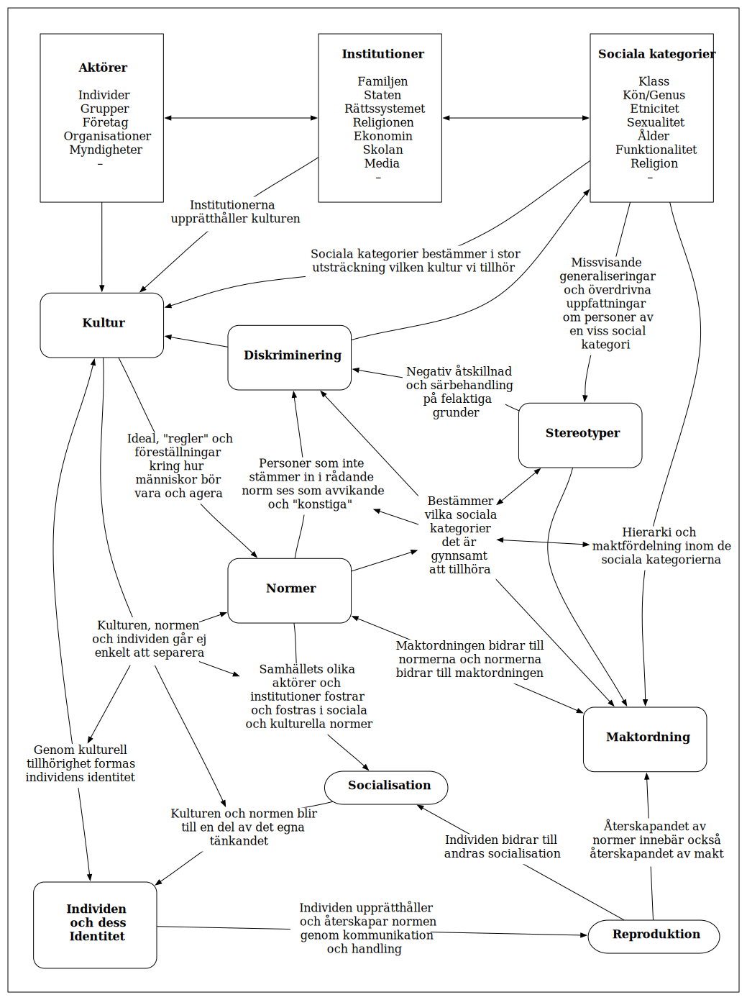

# Centrala begrepp

***

## Samhällets strukturer

En samhällsstruktur är det samspelsmönster vi kan se på övergripande samhällelig nivå (se kartan ovan). Denna struktur ges av hur samhället är ordnat genom dess institutioner (politiskt) men också genom hur samhällets individer generellt agerar (kulturen).

Samhällets strukturer har i detta två olika delar. De **formella strukturerna** är de "regler" som står skrivna, svart på vit –  exempelvis i lagen. De **informella strukturerna** är de "regler" som inte står skrivna, men som vi ändå förväntas att följa – med andra ord _normer_.

Ett samhälle binds samman av gemensamma förväntningar och regler. Strukturen är en slags ram för samhället som reglerar vilka beteenden som är ok och inte. Samhällets strukturer kan därför vara lika förtryckande som de är nödvändiga. Strukturer möjliggör vårt liv tillsammans men de kan också innebära en ibland oönskad och ofta problematisk makt över våra liv. 

## Kultur & normer

Begreppet **norm** ligger inte jättelångt ifrån begreppet struktur. Skillnaden är att en norm är en specifik regel och att en norm (i vanlig mening) alltid är informell (ej nedskriven – och därmed informell). I en viss mening kan vi kalla en viss juridisk lag för en norm, men det är vanligen inte det vi menar med begreppet. Det ordet "norm" vanligen syftar till är de "regler" som hör kulturen till. 

En **kultur** är, i sin tur, ett slags "paket" eller uppsättning av normer (regler). En kultur reglerar, precis som strukturen/strukturerna (vilken kulturen är en del av), vad som förväntas av oss.

Vi är alla medlemmar av (flera) olika kulturer (det finns ingen "monokultur") och ofta innebär detta att vi har motstridiga förväntningar på oss. Exempelvis har vår familj en uppsättning normer, vår bekantskapskrets en annan och vår skola, eller vårt jobb, en tredje, osv. 

<!--Ha allt detta ovanför samhällets strukturer? -->

### Socialisation & reproduktion

_Att vi alla tillhör olika kulturer/grupper innebär:_

1. Att vi ”fostras” att följa och internalisera vissa regler, värderingar & normer (internalisering = vi gör dem till våra egna). Vi lär oss vilka förväntningar de olika grupperna vi tillhör har på oss. 

2. Att vi ofta(st) väljer att följa dessa för att inte hamna utanför gruppen, eller på ett eller annat sätt bli "straffade".

Detta kallas **socialisation** och denna är en till stor omedveten _process_ (den händer utan att vi tänker på det). När vi i sin tur, genom både handling och kommunikation, "fostrar" andra i de regler, värderingar och normer _vi lärt oss_ **reproducerar** vi dessa (vi "återskapar" dem).

#### Identitet

Vår identitet formas i stor utsträckning av de grupper vi tillhör...

## Makt

### Olika typer av makt

### Diskriminering

#### Strukturell diskriminering