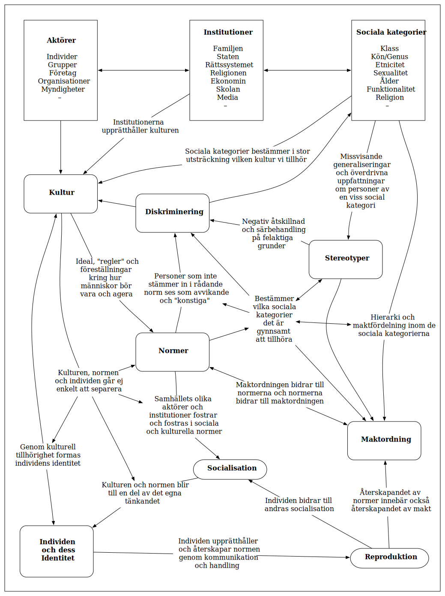

# Centrala begrepp

## Samhällets strukturer
= Det samspelsmönster vi kan se på samhällelig nivå.

***

## Kultur & normer

### Socialisation & reproduktion

#### Identitet

## Makt

### Olika typer av makt

### Diskriminering

#### Strukturell diskriminering